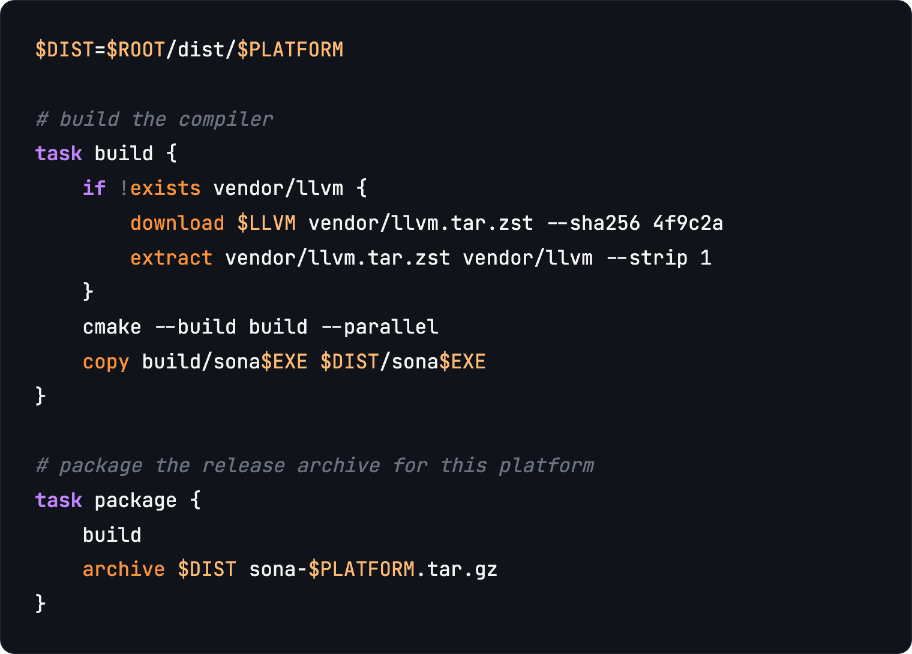
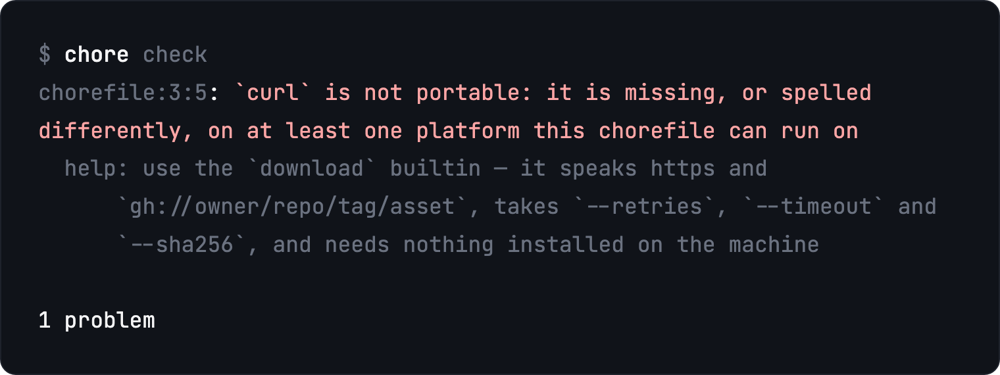

<div align="center">


# chore

**One binary. Every task. Every OS.**

Run your project's tasks from a `chorefile`, through a shell that lives inside
the binary. The same file does the same thing on macOS, Linux and Windows.

[**Get started**](https://getchore.github.io/) &nbsp;·&nbsp; [**Reference**](https://getchore.github.io/reference) &nbsp;·&nbsp; [**Releases**](https://github.com/getchore/chore/releases/latest)

[](https://github.com/getchore/chore/actions/workflows/ci.yml) [](https://github.com/getchore/chore/releases/latest) [](LICENSE)

</div>

---

## Install

```console
curl -fsSL https://getchore.github.io/install.sh | sh
```

```console
irm https://getchore.github.io/install.ps1 | iex
```

## A chorefile



`download`, `extract`, `archive` and `copy` are builtins, so this needs nothing
installed and behaves the same everywhere.

## It tells you what won't work on Windows



Nothing runs. Errors exit nonzero; a command missing only from *this* machine
is a warning, so a CI-only tool doesn't break the gate.

## More

- [**Guide and reference**](https://getchore.github.io/) — and [`llms.txt`](https://getchore.github.io/llms-full.txt) for agents
- [**setup-chore**](https://github.com/getchore/setup-chore) — `- uses: getchore/setup-chore@v1`
- [**VS Code extension**](https://github.com/getchore/chorefile-vscode) — highlighting for `chorefile` and `.chore`
- `chore completions --write` — tab completion for bash, zsh, fish and powershell
- [docs/SPEC.md](docs/SPEC.md) · [docs/RELEASING.md](docs/RELEASING.md)

`chore` builds itself with its own [`chorefile`](chorefile) — `chore ci` is the
gate CI runs.

## License

MIT
